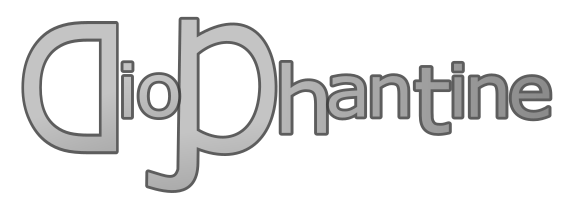

<p align="center" style="text-align:center; font-size:large;" >
  <a href="https://kevduc.github.io/diophantine/">
    
  </a>
</p>

<p align="center" style="text-align:center; font-size:large; margin-bottom:2em;" >
    Solve linear Diophantine equations<br/>
    <code>ax + by = c</code>
</p>

[](https://www.npmjs.com/package/diophantine)
[](https://kevduc.github.io/diophantine)
[](https://www.npmjs.com/package/diophantine)

[](https://david-dm.org/kevduc/diophantine)
[](https://github.com/kevduc/diophantine/actions/workflows/npm-publish.yml)
[](https://github.com/kevduc/diophantine/commits/main)

[](https://commerce.coinbase.com/checkout/97a05cdf-7d82-4f9a-9a24-fbbc65ac5a4d)

<!-- [](https://snyk.io/advisor/npm-package/diophantine) -->

**npm**: **`npm i diophantine`** – [npmjs.com/diophantine](https://www.npmjs.com/package/diophantine)  
**Documentation**: [kevduc.github.io/diophantine](https://kevduc.github.io/diophantine/)  
**GitHub**: [kevduc/diophantine](https://github.com/kevduc/diophantine)  

## Example

### `example.js`

```js
const { dioSolve, SolutionType } = require('diophantine')

const a = 59
const b = -7
const c = 4

console.log(`Solving: ${a}x + ${b}y = ${c}`)

const { solutionType, g, z, m, p } = dioSolve(a, b, c)

switch (solutionType) {
  case SolutionType.None: {
    console.log(`No solution (gcd = ${g} ∤ c = ${c})`)
    break
  }
  case SolutionType.Unique: {
    console.log(`Unique solution: ${z[0] !== null ? `x = ${z[0]}` : `y = ${z[1]}`}`)
    break
  }
  case SolutionType.Linear: {
    console.log(`   gcd = ${g}`)
    console.log(`   x0 = ${z[0]}, y0 = ${z[1]}`)
    console.log(`   ${a} × ${z[0]} + ${b} × ${z[1]} = ${z[0] * a + z[1] * b}`)
    console.log(`Solutions: x = ${m[0]}n + ${p[0]}, y = ${m[1]}n + ${p[1]}`)
    break
  }
  default: {
    console.log(`Solution: ${solutionType}`)
    break
  }
}
```

### Console output

```
Solving: 59x + -7y = 4
  gcd = 1
  x0 = -8, y0 = -68
  59 × -8 + -7 × -68 = 4
Solutions: x = 7n + 6, y = 59n + 50
```

## Support the dev

<p style="font-size:larger"><a href="https://commerce.coinbase.com/checkout/97a05cdf-7d82-4f9a-9a24-fbbc65ac5a4d">Donate a hot chocolate with crypto</a></p>
